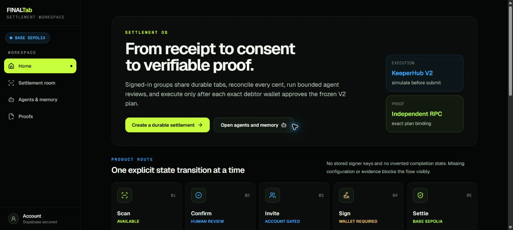
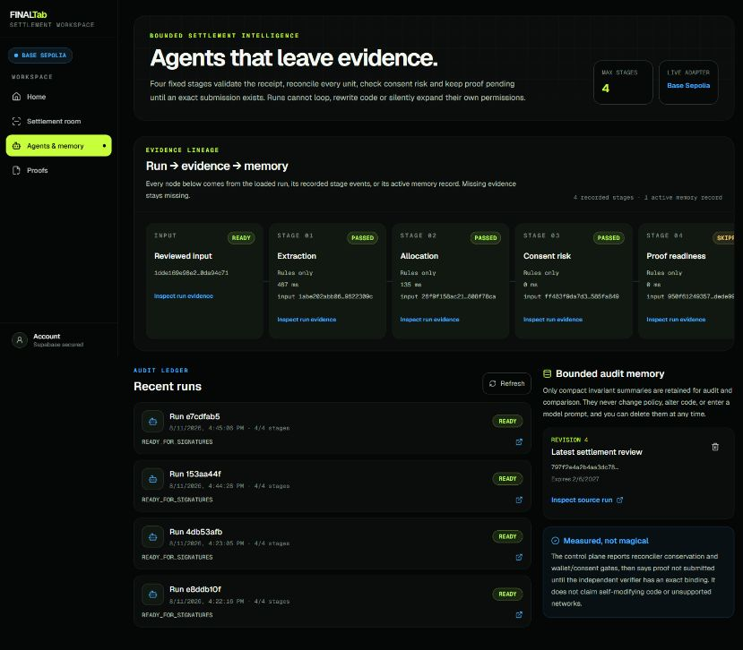
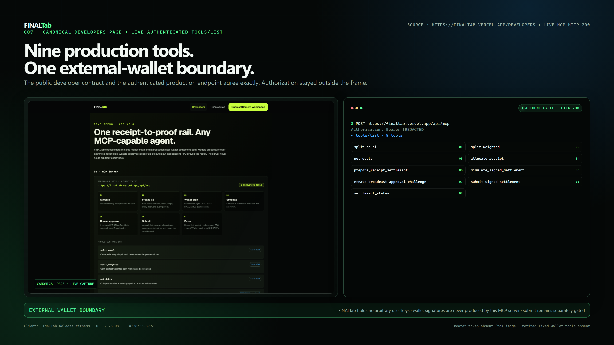
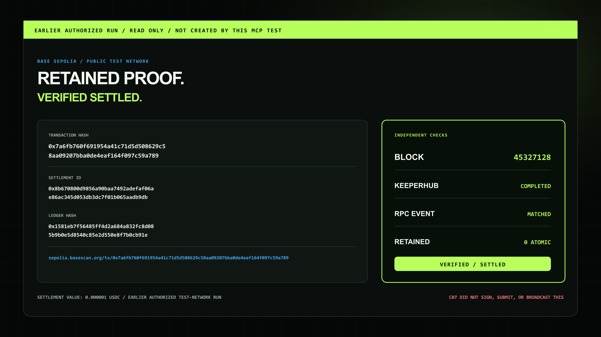
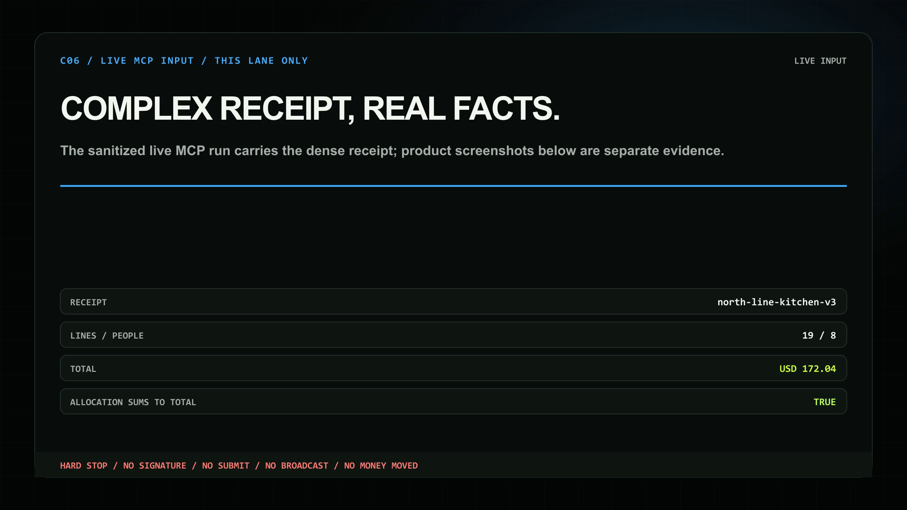
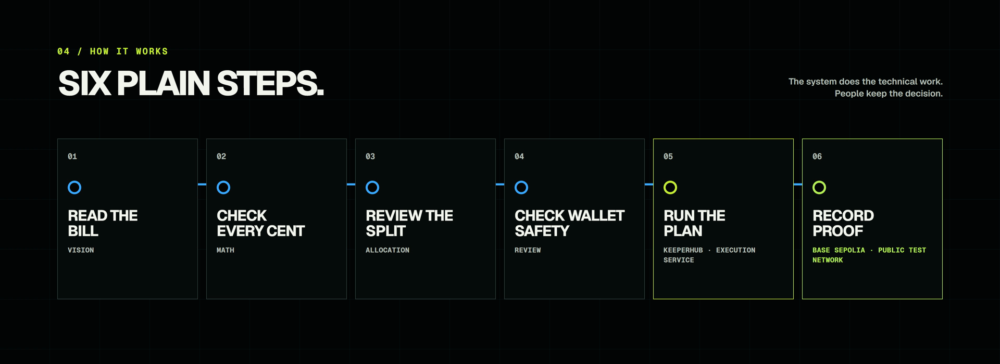
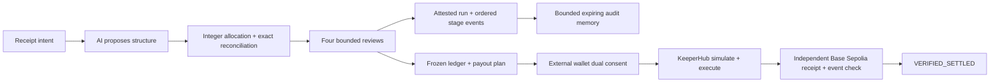

# FINALTab

Turn a shared receipt into an exact, externally signed USDC settlement, route
the transaction through KeeperHub, and refuse to call it settled until both
KeeperHub and an independent Base Sepolia check prove it landed.

Built for KeeperHub Agents Onchain. Current submission readiness is tracked in
[docs/release/status.md](docs/release/status.md); historical evidence does not
override that file.

## Finalist evidence

The live product, retained onchain proof, agent memory lineage, and developer
surface are captured below from the verified release package. The retained
KeeperHub settlement is an earlier authorized run; it was **not** created by the
filmed non-value MCP test.

| Product surface | Bounded agent memory |
|---|---|
|  |  |

| Nine-tool developer surface | Retained proof: one atomic moved, contract retained zero |
|---|---|
|  |  |

### Complex task evidence



The sanitized live MCP lane reconciled 19 lines across eight caller-labelled
participants to exactly USD 172.04. It stopped with no signature, submission,
broadcast, or value movement; the retained settlement proof above is a separate
earlier authorized run.

### Proof-carrying architecture





The memory graph is evidence lineage, not self-modifying intelligence: it is
derived from loaded run inputs, recorded stage events, evidence hashes, and
compact retained audit records. It cannot rewrite settlement policy, source
code, or wallet authorization.

- Live product: [finaltab.vercel.app](https://finaltab.vercel.app/)
- 90-second film: [YouTube](https://youtu.be/eXZACnOdt5w)
- DoraHacks submission: [FINALTab BUIDL #47656](https://dorahacks.io/buidl/47656)
- Finalist deck: [docs/pitch/FINALTab-Finalist-Pitch.pptx](docs/pitch/FINALTab-Finalist-Pitch.pptx)
- Finalist talk track and demo runbook: [docs/pitch/FINALIST_PITCH.md](docs/pitch/FINALIST_PITCH.md)
- Judge Q&A: [docs/pitch/JUDGE_QA.md](docs/pitch/JUDGE_QA.md)

## Hackathon category map

| Category | Evidence | Boundary |
|---|---|---|
| **Blockchain** | `FinalTabBatchSettlementV2` is deployed on Base Sepolia through KeeperHub and is an exact Sourcify creation/runtime match. | Deployment and a one-atomic-unit value-moving V2 run are independently proven. |
| **Web3** | Debtors use external wallets for EIP-3009 and full-plan `SettlementConsent` signatures. | The server does not hold arbitrary participant keys. |
| **DeFi** | The V2 rail pulled and paid one atomic unit of testnet USDC atomically, with exact before/after conservation, and fails the entire batch on invalid consent, replay, or imbalance. | No mainnet claim is made; this is a deliberately minimal Base Sepolia proof. |
| **AI Agents** | Models interpret receipts; deterministic code performs allocation, netting, hashing, and settlement validation. | A model never chooses or authorizes value movement. |
| **Onchain** | KeeperHub execution is paired with independent Base Sepolia receipt and indexed-event checks. | A transaction hash or `completed` string alone is never proof. |
| **MCP** | Production exposes exactly nine authenticated tools for calculation, preparation, execution safety, and proof. Authenticated `initialize`/`tools/list`, `split_equal`, and arbitrary-participant V2 preparation passed against the canonical release. | These were non-value probes. The retained one-atomic-unit settlement was a separately authorized runner, not an MCP broadcast-challenge trace. |
| **Autonomous Agents** | The first-party settlement room runs a fixed four-stage review over receipt validity, allocation arithmetic, consent risk, and proof preflight before Freeze can unlock. | The memory is bounded, HMAC-attested audit memory—not self-modifying policy or code. External MCP callers use the explicit signed-payload contract instead of bypassing wallet consent. |
| **Infrastructure** | OpenAPI, discovery metadata, a KeeperHub workflow package, scoped MCP auth, a shared durable submission journal, proof tooling, and a provisioned London Supabase project make the rail reusable. | The hosted schema is verified at 31/31 public tables under RLS. The financial-truth cutover is applied; advisors have zero error-level findings, with reviewed warnings still disclosed. |

## Product flow

1. **Extract.** A vision model returns structured receipt lines. Model output is
   schema-checked and never trusted for arithmetic.
2. **Allocate.** The engine converts decimal strings to integer minor units and
   applies deterministic largest-remainder allocation so shares reconcile
   exactly.
3. **Net.** The debt graph is reduced deterministically to at most `n-1`
   transfers. FINALTab does not claim that greedy netting is globally minimal.
4. **Review.** The first-party UI commits an attested four-stage review. Editing
   the receipt, participants, payer, or allocation invalidates that review.
5. **Freeze.** Only the current accepted review can unlock Freeze. Canonical
   ledger and complete V2 debit/payout plan hashes lock the state wallets review,
   using the durable receipt UUID rather than a browser-only slug.
6. **Consent.** Every debtor's external wallet signs Circle USDC
   `ReceiveWithAuthorization` and FINALTab `SettlementConsent`. The server does
   not hold arbitrary user keys.
7. **Simulate.** KeeperHub simulates the exact signed V2 call before any
   broadcast request.
8. **Approve.** A permitted human wallet reviews and EIP-191-signs a short-lived
   challenge bound to the authenticated API principal, chain, V2 contract,
   ledger, and plan.
9. **Execute and verify.** The first-party UI, REST, and MCP value-moving paths
   share one service-authored durable intent journal before KeeperHub receives a
   deterministic idempotent call. An accepted replay returns the recorded
   execution without another simulation or execution; prepared crash recovery
   reuses the stored successful simulation and the same idempotency key while
   the persisted approval lease remains bounded. Fresh first-party execution
   still requires current database approvals and a valid wallet approval at the
   final pre-broadcast gate.
   `VERIFIED_SETTLED` requires a successful KeeperHub receipt plus an
   independently fetched receipt whose indexed settlementId and ledgerHash match the frozen plan.

## Current V2 deployment

`FinalTabBatchSettlementV2` is live on Base Sepolia:

| Proof | Value |
|---|---|
| Contract | [`0x7b58791cEBD9A82F8Ee4E4cF87e7AD1B64A3cCDB`](https://sepolia.basescan.org/address/0x7b58791cEBD9A82F8Ee4E4cF87e7AD1B64A3cCDB) |
| KeeperHub execution | `xasakw5nfxkh2s0fh4stn` |
| Deployment transaction | [`0x904ec881…e8f`](https://sepolia.basescan.org/tx/0x904ec881ef7c2ec7375c20887b4181cf58224b44162d837743fa869b0a598e8f) |
| Block | `45321107` |
| KeeperHub receipt | `verified: true`, `receiptStatus: "success"` |
| Source | [Sourcify exact creation/runtime match](https://repo.sourcify.dev/84532/0x7b58791cEBD9A82F8Ee4E4cF87e7AD1B64A3cCDB), match ID `43497805` |

Retained manifest:
[docs/release/evidence/v2-deployment-2026-08-11T01-08-17-421Z.json](docs/release/evidence/v2-deployment-2026-08-11T01-08-17-421Z.json).

This transaction proves deployment and source matching. A separate, value-moving
V2 settlement is also retained: KeeperHub execution `3hmlqi36zweiwg6fc5o2u`
landed [tx `0x7a6fb760…a789`](https://sepolia.basescan.org/tx/0x7a6fb760f691954a41c71d5d508629c58aa09207bba0de4eaf164f097c59a789)
at block `45327128`. It moved exactly `1` atomic unit (`0.000001` USDC), emitted
one exactly bound `SettlementExecuted`, debited the debtor by `1`, credited the
creditor by `1`, retained `0` in the contract, and conserved balances. The
KeeperHub receipt and an independent Base Sepolia RPC check both verified the
run. Retained evidence:
[docs/release/evidence/v2-live-settlement-2026-08-11T04-28-59-530Z.json](docs/release/evidence/v2-live-settlement-2026-08-11T04-28-59-530Z.json).

This minimal proof used explicitly authorized disposable Base Sepolia signer
material and a simulate-then-single-broadcast runner. It proves the V2
dual-signature contract rail and KeeperHub execution; it does not by itself
prove the production MCP short-lived human-approval path.

## Authenticated MCP V2

Endpoint: `https://finaltab.vercel.app/api/mcp`

Every request requires a scoped bearer token. Store only SHA-256 token digests
in `FINALTAB_API_TOKENS_JSON`; never expose raw tokens in client code, logs,
screenshots, or traces.

The current source registers exactly nine production tools:

- calculation: `split_equal`, `split_weighted`, `net_debts`;
- product: `allocate_receipt`, `prepare_receipt_settlement`;
- execution safety: `simulate_signed_settlement`,
  `create_broadcast_approval_challenge`, `submit_signed_settlement`;
- proof: `settlement_status`.

No fixed-wallet money tool or server-held participant key remains on the current
production surface. The old `confirm: true` flag is not a V2 authorization
mechanism. The canonical release was authenticated and re-probed:
`tools/list` returned exactly these nine tools, and non-value calculation and
V2 preparation calls passed. No MCP submission was called during that probe.

All three value-moving entry points—first-party UI, `POST /api/settle/execute`,
and MCP `submit_signed_settlement`—are implemented against the same hosted
`settlement_submission_intents` journal. New work simulates and commits a
`prepared` intent before KeeperHub. A retry with a durably recorded acceptance
skips simulation and execution and returns that execution; a `prepared` retry
reuses the stored successful simulation and deterministic idempotency key. The
schema is applied. The canonical application and authenticated collaboration
write path are live-proven, but cross-channel accepted-replay, prepared
crash-recovery, and two-identity tenant isolation remain source/test/schema
claims until separately exercised in production.

Configuration and flow details:
[docs/integrations/mcp.md](docs/integrations/mcp.md).

## Hybrid voice — configuration-gated

The settlement workspace includes an optional, text-first voice layer:

- **AssemblyAI live STT** turns browser-microphone speech into an editable
  allocation instruction. The server mints a short-lived EU streaming token;
  the permanent AssemblyAI key never reaches the browser.
- **ElevenLabs readback** generates a short spoken confirmation through a
  bounded server proxy. Text remains visible and editable, and no transcript
  can allocate, sign, or submit value by itself.
- **Product-film narration** is a separate eight-scene local Kokoro asset with
  offline alignment driving the caption track. The release made one
  ElevenLabs quota-check request, received a fail-closed denial, made zero
  ElevenLabs synthesis requests, and did not retry.

These paths are deployed and their provider keys are stored as sensitive Vercel
Production variables. Supabase enforces durable per-user quotas of 8
transcription sessions and 20 readbacks per minute through the server-only
reservation path. A real production microphone/readback provider lifecycle has
not completed, so voice remains **configured and deployed, not live-proven**.
AssemblyAI is not used to narrate the product video.

## Identity and durable agent control

Supabase Auth is the canonical account and RLS identity. GitHub OAuth is the
primary public entry path through the existing SSR PKCE callback; overlapping
flows are correlated to their per-flow verifier, continuations are same-site,
and the branded return page is provider-neutral. The server-only feature flag
records configuration intent only. On the current canonical release, a real
GitHub OAuth round trip reached the branded return page and `/app`, survived a
full reload, and was followed by an authenticated RLS-backed tab create/read.
The Production email-fallback flag is false, so the email/OTP UI is hidden;
Supabase default mail is not advertised as public delivery. Privy is an optional
linked-wallet identity bridge; its tokens
never become settlement or MCP principals, and its provisioned wallet is not
used by the V2 execution rail. The authenticated dashboard showed that the
required Custom Authentication feature needs the paid Scale tier, so the bridge
is deliberately disabled under the stop-before-charge constraint. It remains
fail-closed, does not appear as a setup warning in the product, and does not
block core readiness. Branded or public inbound email also remains pending a
verified sender domain and custom SMTP or Send Email Hook.

The settlement-agent control plane persists attested run, stage-event, and
bounded audit-memory records. It cannot alter code or policy, and stage four
records pre-signature proof as honestly skipped. The hosted database now has the
baseline plus the ordered additive migrations `20260811052236` (agent control),
`20260811060000` (agent-event composite-FK coverage), `20260811064822` (voice
spend reservations), `20260811073000` (first-party settlement flow), and
`20260811074000` (shared submission intents), plus `20260812023200` (V3
narration-generation journal) and `20260812090000` (durable pre-Freeze tab
drafts), followed by the financial-truth
cutover and `tab_owner_select_returning` repair: 31/31 public tables have RLS, the
sensitive mutation RPCs deny `PUBLIC`, `anon`, and `authenticated` while allowing
`service_role`, the unindexed-FK warning is cleared, and authenticated direct
financial writes plus the legacy quota RPC are revoked. Database advisors have
zero error-level findings, not zero findings: reviewed RLS/function warnings and
the leaked-password-protection warning remain. The owner-select repair fixes
`INSERT ... RETURNING` without broadening writes; a real production tab create,
owner membership, participant add, and audit record were verified.

## Money and security rules

- All money arithmetic uses integer minor units; floats never touch balances.
- USD 2-decimal minor units map to USDC 6-decimal units at face value. Other
  currencies may split but are refused for onchain settlement without an
  explicit conversion source.
- The model proposes; the deterministic engine decides and reconciles.
- `ReceiveWithAuthorization` names the settlement contract as recipient.
- V2 `SettlementConsent` binds the complete ordered debit/payout plan.
- Invalid signature, nonce, expiry, consent, replay, or conservation reverts
  the atomic batch.
- A hash or `completed` status alone is never settlement proof.

## Repository

| Path | Responsibility |
|---|---|
| `packages/engine` | Integer money, allocation, netting, hashes, V2 plan and signature payloads |
| `packages/vision` | Receipt extraction and allocation proposals |
| `packages/keeperhub` | Simulation, execution, polling, idempotency, fail-closed receipt classification |
| `packages/keeperhub-flight-recorder` | `kh-proof` CLI and auditable verdict output |
| `contracts` | V1 history plus `FinalTabBatchSettlementV2` and adversarial tests |
| `apps/web` | Next.js product, authenticated MCP/API surfaces, proof and integration routes |
| `supabase/migrations` | Baseline, additive, financial-truth cutover, and tab-owner select-repair migrations applied and verified |
| `docs/release` | Canonical status, checklist, trace contract, and retained evidence |

## Run and verify

```bash
pnpm install
pnpm lint
pnpm typecheck
pnpm test
pnpm test:contracts
pnpm build
pnpm test:e2e
```

Copy `.env.example` to the web deployment's environment and supply secrets
server-side. The example pins the public V2 address and protocol version. The
current production source contains no fixed-wallet money tools.

The canonical production release is Vercel deployment
`dpl_F5PgMqo7A9zecQW2LKos2FcCNVMs` at commit
[`039582fc44901d1f436b61a426f1523a936427f9`](https://github.com/vaibhav4046/finaltab/commit/039582fc44901d1f436b61a426f1523a936427f9).
Its exact-SHA GitHub Actions run is green, `/api/health` reports `ready`, and
Playwright passed **14/14** desktop-and-mobile journeys against
`https://finaltab.vercel.app`. Volatile local test totals are intentionally not
promoted here until the final post-video worktree is rerun.

## Historical V1 evidence

V1 at `0xCcf6b4Def9A70b52F5fB78Aa38CD274a05aB7e64` executed real
Base Sepolia testnet-USDC settlements on 2026-08-10. A historical MCP run used
fixed demo signers, seven former tools, and `settle_tab(confirm: true)`:
execution `69zzrj7z676u89ce1x76j`,
[tx `0x314189b4…c5eb`](https://sepolia.basescan.org/tx/0x314189b472033de62f8aea7603111c141315be390bc834e283e718382261c5eb),
block `45315909`.

Those records remain evidence of V1 behavior only. Current V2 proof comes from
the separate 2026-08-11 one-atomic-unit run above. Likewise, the historical
101.64-second video and older 92.7-second cut are not current submission media.

## Current boundaries and next gates

- Keep the canonical non-value MCP probe and retained V2 settlement visibly
  separate; do not imply the standalone runner exercised the MCP human
  broadcast-challenge path.
- Complete a real production microphone/readback lifecycle before advertising
  hybrid voice as live; the release and durable server-side budget controls are
  deployed, but the browser microphone did not complete its permission flow.
- Keep two-identity tenant isolation, review invalidation, durable value
  submission, and crash recovery labeled source/test/schema-proven until each
  receives its own production exercise.
- Keep the optional Privy bridge disabled unless a future paid-plan decision is
  explicitly authorized. A verified sender domain plus custom SMTP or a Send Email Hook is separately
  required before claiming a branded inbound authentication email.
- The [DoraHacks BUIDL](https://dorahacks.io/buidl/47656) is submitted and under
  review, and the stackable Best Onboarding UX Improvement bounty application
  is saved. Monitor the submitted Telegram and Discord contacts for judge
  follow-up.

## KeeperHub onboarding contribution

[KeeperHub/cli PR #95](https://github.com/KeeperHub/cli/pull/95) adds
`--require-verified` to fail closed on unverified execution status. It was open
and not merged when last checked; recheck GitHub before using its state in a
future announcement. FINALTab is also attached to the stackable DoraHacks Best
Onboarding UX Improvement bounty.
