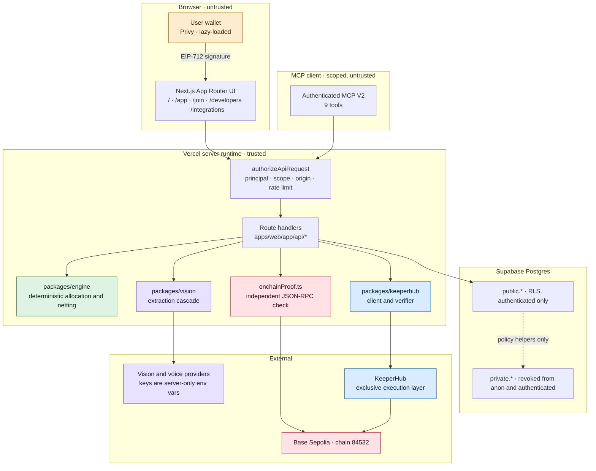
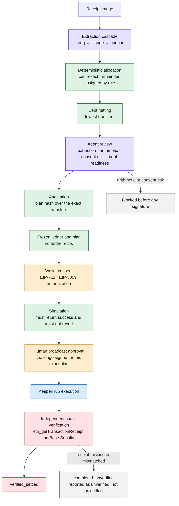
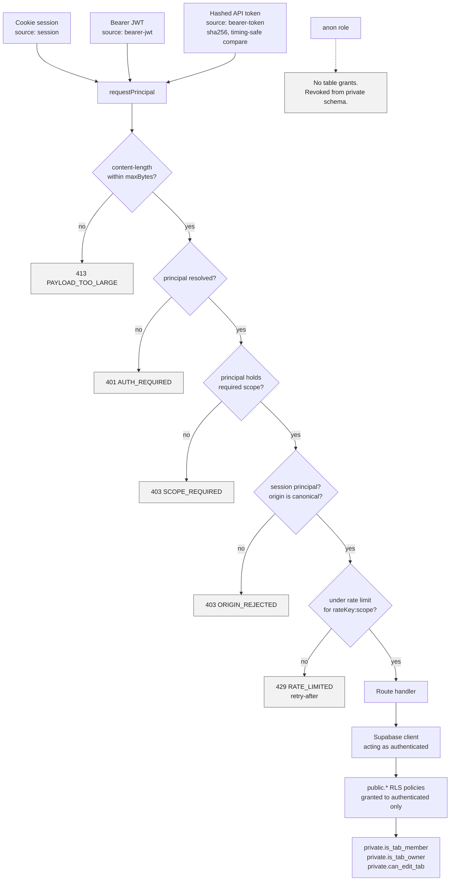
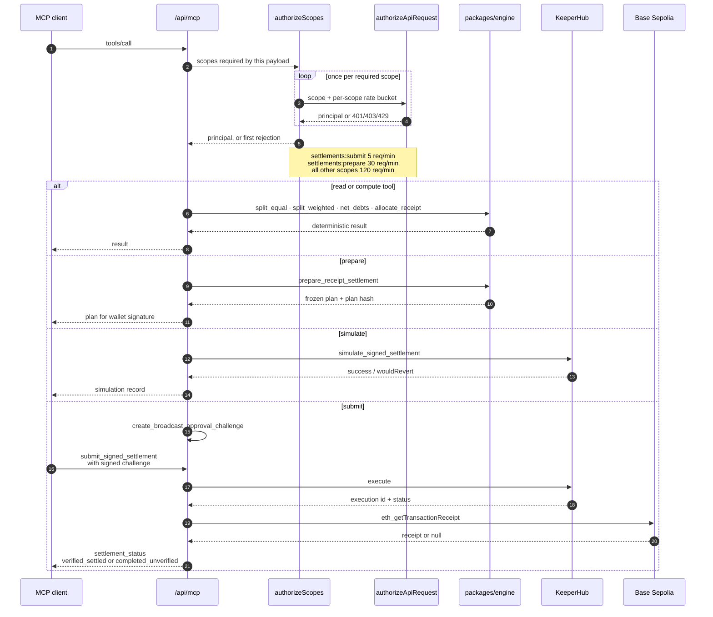
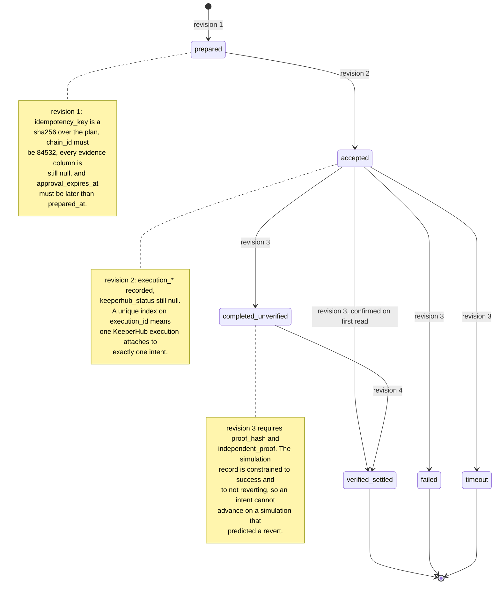
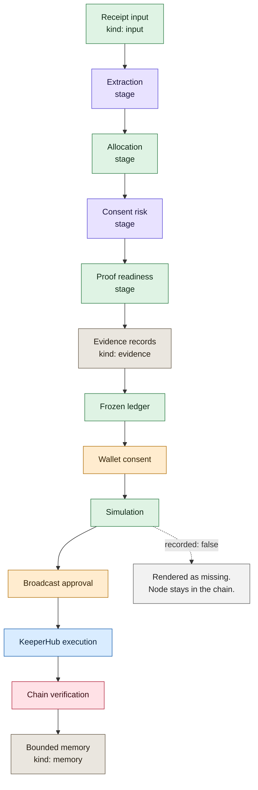

# FINALTab architecture

How the current V2 system is put together, in six diagrams.

This document describes the code on `agent/finaltab-voice-hybrid`, whose tip is
also the `main` tip. It is not a deployment claim:
[docs/release/status.md](release/status.md) is the operational source of truth
for what is running, and production currently serves commit
`cb8b6484427d30cb31a0a2dd511e617ff42dda06`, which the live `/api/health`
reports as `commit: cb8b6484427d`. The archived V1 map lives in
[docs/release/architecture.md](release/architecture.md) and is kept as history
rather than updated.

Every diagram below is drawn from source. Where a diagram distinguishes who
produced a value, it uses the same six-way provenance split the product itself
renders, defined in
[`apps/web/lib/agentMemoryGraph.ts`](../apps/web/lib/agentMemoryGraph.ts):

| Provenance | Meaning |
|---|---|
| `model` | A language or vision model proposed it. Never authoritative over money. |
| `deterministic` | Computed by `packages/engine`. Same input, same cents, every time. |
| `human_wallet` | A person signed it with a wallet they control. |
| `keeperhub` | Returned by the KeeperHub execution layer. |
| `onchain` | Read back from Base Sepolia by an independent JSON-RPC check. |
| `memory` | A bounded evidence record retained for later runs. |

---

## 1. System and trust boundaries

Nothing a model produces crosses into the money path without a deterministic
recomputation and a human wallet signature in between. The private schema and
the provider keys sit on the far side of the server boundary and are never
reachable from a browser.

**Boundary rules that hold in code, not just in prose**

- Provider keys for vision and voice exist only as sensitive server environment
  variables. No provider key is ever sent to a browser.
- `private.*` is revoked from `public` and `anon`, and its RLS helper functions
  are `SECURITY DEFINER` with an empty `search_path`, granted only to
  `authenticated`.
- No participant private key is held server-side. Consent is an EIP-712
  signature produced in the user's own wallet.
- KeeperHub is the only execution path. The server never broadcasts directly.

---

## 2. Settlement lifecycle

The full path from a photographed receipt to a settlement the product is willing
to call settled. Colour marks who produced each step.

The two failure edges are the point. An agent review that flags an arithmetic or
consent problem stops the flow before any signature exists, and a settlement
whose onchain receipt cannot be confirmed lands in `completed_unverified` rather
than being reported as done.

---

## 3. Authentication and the RLS boundary

Three principal sources reach the same authorization funnel, and they are not
equivalent. A cookie session is the only one subject to the same-origin check,
and it is also the only one eligible for the narrow session-fallback scope.

**Scopes.** Six exist: `tabs:read`, `tabs:write`, `receipts:write`,
`settlements:prepare`, `settlements:submit`, `settlements:read`. A newly created
signed-in user receives five of them by default. `settlements:submit` is
deliberately not among them: it must be granted explicitly in
`app_metadata.finaltab_scopes` or on a hashed bearer token, so missing
authorization metadata is never equivalent to a grant to broadcast value.

**Least privilege in the database.** Policies are attached `to authenticated`,
never to `public` or `anon`. Membership is resolved through `SECURITY DEFINER`
helpers in the `private` schema, which exist to avoid recursive policies and
which begin by requiring a real `auth.uid()`. Signatures and USDC
authorizations have no authenticated `SELECT` grant at all: collaboration UI
reads approval state through a narrow RPC that returns state without returning
signature material.

---

## 4. MCP request lifecycle

The MCP surface is not a second, looser door into the money path. It shares the
authorization funnel from diagram 3, and its value-moving tool is rate limited
six times harder than its read and prepare tools.

A tool is never authorized on a scope it did not ask for: `mcpScopesForPayload`
derives the required scope set from the payload, and every one of them has to
pass before the handler runs. The nine tools, in registration order: `split_equal`,
`split_weighted`, `net_debts`, `allocate_receipt`,
`prepare_receipt_settlement`, `simulate_signed_settlement`,
`create_broadcast_approval_challenge`, `submit_signed_settlement`,
`settlement_status`.

---

## 5. Durable submission intent and idempotency

Every value-moving surface, first-party UI and REST and MCP alike, creates the
same deterministic intent row before KeeperHub is called. The row is the reason
a crashed or retried submission cannot become two onchain transfers.

The state and the revision are checked together, not separately. Each revision
is a `check` constraint listing exactly which evidence columns must be present
and which must still be null, so a row cannot claim a later state while missing
the evidence that state is supposed to carry. Advancing the story requires
producing the proof.

---

## 6. Agent memory as bounded evidence lineage

The memory graph is not a self-modifying model and holds no learned weights. It
is a bounded record of what each run actually produced, arranged so a reader can
walk from the receipt to the chain and see every hand the value passed through.

Two properties make this an evidence structure rather than a story.

**Gaps stay visible.** A node whose service returned no evidence is kept in the
chain with `recorded: false` and counted in `missingCount`. It renders as
missing. No node is ever synthesised from a value the service did not return, so
an incomplete run looks incomplete instead of looking successful.

**Provenance is per node, not per graph.** The same six-way split from the table
at the top of this document is attached to each node, which is what lets a
reader see at a glance that the arithmetic was deterministic, the consent was
human, and the confirmation was read back over an independent JSON-RPC call
rather than taken from the executor's own word.

---

## Where to look in the code

| Concern | Path |
|---|---|
| Authorization funnel | [`apps/web/lib/server/apiAccess.ts`](../apps/web/lib/server/apiAccess.ts) |
| MCP surface | [`apps/web/app/api/mcp/route.ts`](../apps/web/app/api/mcp/route.ts) |
| Deterministic allocation and netting | [`packages/engine/src/index.ts`](../packages/engine/src/index.ts) |
| Extraction cascade | [`packages/vision/src/fallbackRouter.ts`](../packages/vision/src/fallbackRouter.ts) |
| KeeperHub client and verifier | [`packages/keeperhub/src/index.ts`](../packages/keeperhub/src/index.ts) |
| Independent chain check | [`apps/web/lib/server/onchainProof.ts`](../apps/web/lib/server/onchainProof.ts) |
| Durable submission intents | [`supabase/migrations/20260811074000_durable_submission_intents.sql`](../supabase/migrations/20260811074000_durable_submission_intents.sql) |
| Tenancy, RLS and approvals | [`supabase/migrations/20260811003158_production_tenancy_and_approvals.sql`](../supabase/migrations/20260811003158_production_tenancy_and_approvals.sql) |
| Memory graph model | [`apps/web/lib/agentMemoryGraph.ts`](../apps/web/lib/agentMemoryGraph.ts) |
| Release truth | [`docs/release/status.md`](release/status.md) |
